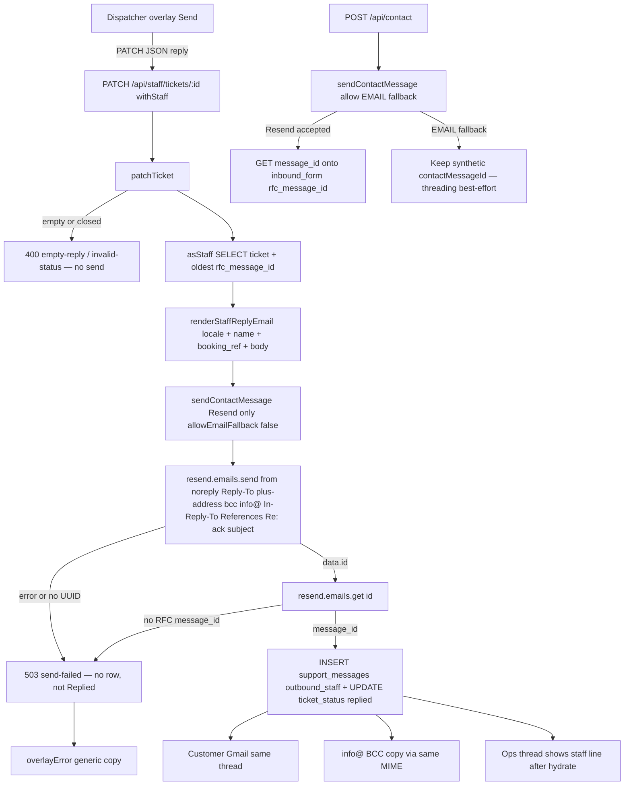

# Phase 13: Staff APIs + outbound Resend replies - Research

**Researched:** 2026-09-15
**Domain:** Staff ticket reply send (Resend) + branded outbound templates (`packages/emails`) + RFC `Message-ID` persistence
**Confidence:** HIGH

<user_constraints>
## User Constraints (from CONTEXT.md)

### Locked Decisions

### What Gmail shows
- **D-01:** Target From is `Vamos Taxi <ticket+{token}@replies.vamostaxi.site>` with the same Reply-To. **Until the owner verifies `replies.vamostaxi.site` in Resend**, send From stays `Vamos Taxi <noreply@vamostaxi.site>` (apex DKIM already exists) and **Reply-To is the plus-address**. Flip From to plus-address only after that verify. Do not steal apex MX.
- **D-02:** Subject is always `Re:` the contact-ack subject. No subject field in the overlay.
- **D-03:** Staff reply (and all `packages/emails` templates this phase) use Vamos brand chrome — charcoal, full-strength yellow as a small accent, wordmark — same family as the dashboard. Gmail will not load Qurova; tokens and layout carry the brand.
- **D-04:** Each template includes only the fields that mail needs. Staff reply: typed body, customer name, `booking_ref` when present, enough thread context to stand alone. No invented legal copy.
- **D-05:** BCC `info@vamostaxi.site` on every staff reply via Resend `bcc`, not a second `EMAIL` send. Customer `To` is only the customer.

### Resend failure
- **D-06:** Fail closed on staff replies (and other Resend-backed sends in this phase). No Cloudflare `EMAIL` fallback. No `support_messages` row, no status **Replied**, until Resend accepts with an id.
- **D-07:** Dispatcher overlay shows a **generic** error (“Couldn’t send. Try again.” / existing `overlayError`). No Resend JSON, no API keys.
- **D-08:** First-place bug was swallowed Resend `error` + EMAIL fallback in `sendContactMessage`. Staff path now `allowEmailFallback: false`. Contact ack may still use EMAIL.
- **D-09:** Owner must add/verify `replies.vamostaxi.site` in Resend (DKIM) before D-01 From flip. Live MX on `replies.` is currently **AWS SES ap-northeast-1** — receiving MX is Phase 16; do not point apex MX at Resend.

### Send rules
- **D-10:** Empty body → error, no send. Closed ticket → no send (composer already no-ops). Body language = **ticket locale**. BCC per D-05.
- **D-11:** Staff send → status **Replied** (Phase 12 D-13). Do not implement inbound → Responded here.

### Overlay this phase
- **D-12:** Wire DC Send now. `OpsSupportTicket.dc.html` already `PATCH /api/staff/tickets/:id` with `{ reply }`. Keep that contract. Dual-DC public copy. Generic `overlayError` on failure (D-07).

### Claude's Discretion
- How to share voucher layout tokens across React email components vs contact.ts HTML strings — planner/researcher.
- Persist both `rfc_message_id` (thread) and `resend_email_id` (provider) — GET-after-send identity is RFC.
- Dual-DC sync for OpsSupportTicket after any composer copy change.

### Deferred Ideas (OUT OF SCOPE)
- Resend **receiving** MX on `replies.vamostaxi.site` (replace AWS SES) — Phase 16
- Inbound webhook matching — Phase 14
- Remaining SUP-03 thread polish if any — Phase 15
- Attachments (SUP-F02), macros/SLA (SUP-F03)
- Live `vamostaxi.eu` DNS
- From plus-address **go-live** until owner verifies `replies.vamostaxi.site` in Resend (D-01 gate)
</user_constraints>

<phase_requirements>
## Phase Requirements

| ID | Description | Research Support |
|----|-------------|------------------|
| RPLY-01 | Dispatcher sends a reply from the ticket; the customer receives it in Gmail on the same thread | Overlay already `PATCH { reply }`. Finish send plumbing: Resend only, `Reply-To` plus-address, `Re:` ack subject, `In-Reply-To` / `References` from stored RFC ids, persist GET-after-send `message_id` (not minted `<s.…@vamostaxi.site>`, not Resend UUID). Brand chrome so the mail is recognisably Vamos. |
| RPLY-02 | `info@vamostaxi.site` receives a copy of that staff reply (BCC). Gmail is a copy; Ops is the working inbox | Pass `bcc: SUPPORT_EMAIL` (`info@vamostaxi.site`) on the same Resend `emails.send`. Do not call `env.EMAIL.send`. Do not put `info@` on `to`. |
</phase_requirements>

## Summary

Phase 13 is send-path completion, not a greenfield mail stack. `PATCH /api/staff/tickets/:id` with `{ reply }` already exists, `sendContactMessage(..., { allowEmailFallback: false, bcc, replyTo, headers })` already refuses Cloudflare `EMAIL` on the staff path, and `support_messages` already has `rfc_message_id` + `resend_email_id`. The work that still fails RPLY-01 is identity: `tickets-write.ts` mints `<s.{uuid}@vamostaxi.site>`, sets `headers["Message-ID"]` to that value, and stores it. Resend’s send response is a UUID; Gmail threads on the RFC `Message-ID` that Resend exposes on **GET `/emails/:id`** as `message_id`. Official threading docs set `In-Reply-To` from that retrieved id. Do not treat the client-minted id, `data.id`, or the 12-char outbox suffix as threadable.

The owner also pulled a branded pass over **every** outbound template in `packages/emails` into this phase (templates + send plumbing only — not quote/checkout/Stripe/`/pricing`). Two chrome families exist today: React `lifecycle-mail.tsx` (wordmark 216×30, `#FDC20B` 4px bar, Poppins/Qurova stack) versus HTML `layout.ts` (Arial, 180px wordmark) and `ConfirmationEmail.tsx` (text “Vamos Taxi”, no ``). Unify tokens; keep both render paths.

**Primary recommendation:** Keep the existing staff PATCH contract. After Resend accepts, `emails.get(id)` and persist `data.message_id` as `rfc_message_id` and `data.id` as `resend_email_id`. Do not set a custom `Message-ID` header. From stays `noreply@vamostaxi.site` until D-01 verify. Extract shared chrome tokens; Point `ConfirmationEmail` and HTML `layout.ts` at the same wordmark + charcoal + 4px yellow bar family. Fail closed. Dual-DC writer is `app/ops/OpsSupportTicket.dc.html`.

**Graph context:** `.planning/graphs/graph.json` is absent; `graphify` is disabled. No graph queries this session.

**Project skills:** no `.claude/skills/`, `.agents/skills/`, or `.codex/skills/` in this repo.

## Architectural Responsibility Map

| Capability | Primary Tier | Secondary Tier | Rationale |
|------------|-------------|----------------|-----------|
| Staff reply authorization (`withStaff`, CSRF Origin) | API / Backend | — | Session + `vamos_staff` already on PATCH. Browser must not hold `RESEND_API_KEY`. |
| Render staff-reply HTML/text (locale, escape) | API / Backend (`@vamos/emails`) | — | Same Worker send path as lifecycle mail. DC only posts `{ reply }`. |
| Resend `emails.send` + BCC + Reply-To + thread headers | API / Backend | Resend | Provider owns SMTP. Worker owns idempotency key and fail-closed. |
| Retrieve RFC `message_id` (GET-after-send) | API / Backend | Resend | Send returns UUID; RFC id is on GET (and `email.sent` webhook — not this phase). |
| Persist `rfc_message_id` + `resend_email_id`, status `replied` | Database / Storage | API / Backend | Columns exist. Insert only after Resend accepted **and** RFC id retrieved (D-06 + discretion). |
| Overlay Send / `overlayError` / empty + closed no-ops | Browser / Client (DC hash console) | API | D-12: keep `PATCH { reply }`. Generic error copy only. |
| Dual-DC public copy of OpsSupportTicket | CDN / Static (build sync) | — | Writer `app/ops/`; `scripts/sync-dc-mock-to-public.mjs` copies into `apps/web/public`. Do not patch public. |
| Contact-form ack | API / Backend | Cloudflare `EMAIL` (fallback) | D-08: may still use `EMAIL`. Prefer Resend when key present (already). Persist RFC when Resend actually sent. |
| Lifecycle / auth / refund template chrome | API / Backend (`packages/emails`) | — | Brand pass is renderers + skip-send, not funnel events. |
| Inbound append / MX / Staff tab / quote | — | — | Out of scope (Phases 14–16, must-nots). |

## Project Constraints (from CLAUDE.md)

Treat as locked, same authority as D-01…D-12:

- Design-system tokens only. Email cannot use `var(--vt-*)`; resolve to the same hex: charcoal `#1E1F1F`, yellow `#FDC20B` full strength, grey `#DEDEDE`. Never invent a colour, font, radius, or shadow.
- No glow. No `--vt-shadow-accent`. No coloured `box-shadow`.
- No tinted yellow / brown (`--vt-yellow-50…300`, `-600/-700`). Yellow is a small accent (bar, primary CTA, kicker), never a wash.
- Four languages same pass (en/de/fr/ar). Swiss German “ss” not “ß”. Arabic `dir="rtl"`, logical properties. Email copy lives in `packages/emails` (`contact.ts` COPY + `messages/*.json`), overlay copy in `OpsSupportTicket` `T`. Both need all four. Do not leave staff-reply or send-error English-only.
- Amounts `CHF 000` / `CHF 00.00` until live book. No invented legal copy (D-04).
- Icons via Lucide `Icon` on DC surfaces. Email wordmark is the hosted PNG, not emoji, not hand-drawn SVG.
- Ops is DC hash console + `OpsSidebar`. No Next `/ops/support`. No Staff tab.
- Dual-DC: edit `app/ops/` then sync; never hand-edit `apps/web/public/app/`.
- Language/currency: overlay already has in-page `T`; new strings go there in the same pass (ops DC pattern), not a new i18n library.

## Standard Stack

### Core

| Library | Version | Purpose | Why Standard |
|---------|---------|---------|--------------|
| `resend` | **6.26.0** in `packages/emails` [VERIFIED: npm registry + lockfile]; **6.24.0** in `apps/web` [VERIFIED: `apps/web/package.json` + `node_modules/resend/package.json`]. Latest on npm **6.28.0** (published 2026-09-11) [VERIFIED: `npm view`]. | `emails.send`, `emails.get` (RFC `message_id`), idempotency key | Already the Worker mail SDK. `GetEmailResponseSuccess.message_id: string` exists on **both** installed copies. Do not add a second mail vendor. |
| `@vamos/emails` | workspace | All outbound HTML/text/React templates + `send.ts` | House package. Brand pass + staff reply renderer live here. |
| `@react-email/components` | **1.0.12** [VERIFIED: `packages/emails/package.json` + `npm view`] | React voucher layout | Already used by confirmation / lifecycle / pay-link. |
| `@react-email/render` | **2.1.0** [VERIFIED: package.json + `npm view`] | HTML snapshots / tests | Already used. |
| `postgres` / `asStaff` | existing (`postgres@3.4.9`) | Ticket load + insert | Same Hyperdrive staff door as Phase 12. |
| DC overlay | `app/ops/OpsSupportTicket.dc.html` | Send UX | D-12 contract. |

### Supporting

| Library | Version | Purpose | When to Use |
|---------|---------|---------|-------------|
| `zod` | 4.4.3 (apps/web) | Optional reply-body schema (trim, 1…8000) | Prefer reuse of DB check + `trim`; add zod only if the planner wants a shared parser. Not required to ship. |
| `vitest` | **4.1.11** [VERIFIED: both packages] | Unit tests | Wave 0 + per-task. |
| `SUPPORT_EMAIL` | `info@vamostaxi.site` | BCC target | `apps/web/lib/contact-channels.ts` — do not hard-code a second address. |
| `BOOKINGS_OPS_EMAIL` | `bookings@vamostaxi.site` | Lifecycle ops copies | Never `info@` except staff-reply BCC (D-05). |

### Alternatives Considered

Locked decisions forbid these. Listed only so the planner does not reopen them.

| Instead of | Could Use | Tradeoff |
|------------|-----------|----------|
| Resend staff send | Cloudflare `EMAIL` | D-06/D-08 forbid. `EMAIL.send` has no GET RFC id; CF `messageId` is documented as “Unique email ID”, not RFC `Message-ID` [CITED: developers.cloudflare.com/email-routing/email-workers/send-email-workers]. |
| GET-after-send | Trust `headers["Message-ID"]` we mint | Gmail/inbound will not match. Official identity is GET `message_id`. |
| Resend `bcc` | Second `EMAIL` send to `info@` | D-05 forbid. Dual-send was the first-place bug. |
| Insert row then send | Send then insert | D-06: no row until Resend accepts. Keep send-then-insert. |
| From plus-address now | Wait for D-01 verify | Unverified From is a Resend 4xx. Stay on `noreply@`. |

**Installation:** no new packages. Optional workspace align (not a new vendor):

```bash
# Only if planner chooses to collapse the 6.24 vs 6.26 split
pnpm add resend@6.26.0 --filter web
```

Do **not** add `svix`, `postal-mime`, `mailparser`, `googleapis`, `imapflow`, or a second `react-email` app. Do **not** bump to `resend@6.28.0` in this phase unless a 6.26 type gap appears — `emails.get` already exists on 6.24.0.

**Version verification (this session):** `npm view resend version` → `6.28.0`; `npm view @react-email/components version` → `1.0.12`; `npm view @react-email/render version` → `2.1.0`. Repo pins: emails `resend@6.26.0`, web `resend@6.24.0`.

## Package Legitimacy Audit

> No new packages are required for this phase. slopcheck was **not available** (`command -v slopcheck` failed; `pip3 install slopcheck` failed). Any *new* install the planner later adds must be tagged `[ASSUMED]` and gated with `checkpoint:human-verify`.

| Package | Registry | Age | Downloads | Source Repo | slopcheck | Disposition |
|---------|----------|-----|-----------|-------------|-----------|-------------|
| `resend` (already in repo) | npm | years (Resend official SDK) | n/a this session | github.com/resend/resend-node [VERIFIED: `npm view resend repository`] | unavailable | Keep; optional pin-align 6.26.0. Do not add a second copy. |
| `@react-email/components` | npm | already in `packages/emails` | n/a | already vendored in workspace | unavailable | Keep. Do not reinstall. |
| `@react-email/render` | npm | already in `packages/emails` | n/a | already vendored | unavailable | Keep. |

**Packages removed due to slopcheck [SLOP] verdict:** none (no candidates)
**Packages flagged as suspicious [SUS]:** none

*slopcheck unavailable — do not treat a version bump as `[VERIFIED]` beyond registry existence. Prefer “no install”.*

## Architecture Patterns

### System Architecture Diagram



File-to-implementation mapping is the table below, not the diagram.

### Recommended Project Structure

```
apps/web/lib/forms/notify.ts              # Resend send + GET rfc helper; staff fail-closed
apps/web/lib/ops/ticket-mail.ts           # plus-address, threadHeaders (no minted Message-ID)
apps/web/lib/ops/tickets-write.ts         # PATCH reply: send → GET → insert
apps/web/app/[locale]/(ops)/api/staff/tickets/[id]/route.ts
apps/web/app/api/staff/tickets/[id]/route.ts   # re-export dual-mount — keep
apps/web/app/api/contact/route.ts         # persist GET rfc on Resend ack only
packages/emails/src/chrome.ts             # NEW: shared hex/fonts/logo (discretion)
packages/emails/src/layout.ts             # HTML envelope consumes chrome.ts
packages/emails/src/lib/lifecycle-mail.tsx
packages/emails/src/contact.ts            # staff reply fields + voucherHtml from chrome
packages/emails/src/ConfirmationEmail.tsx # wordmark Img, not text lockup
packages/emails/src/lib/send.ts           # skip-send if copy missing; From stays noreply
app/ops/OpsSupportTicket.dc.html          # sendError copy; writer
scripts/sync-dc-mock-to-public.mjs        # dual-DC — run via prebuild, do not patch public
```

Do **not** create `POST /api/staff/tickets/:id/reply`. D-12 keeps `{ reply }` on PATCH.

### Pattern 1: GET-after-send RFC identity

**What:** After `emails.send` returns `{ id }`, call `emails.get(id)` and store `message_id` (RFC, angle-bracketed) plus `id` (Resend UUID).
**When to use:** Every Resend-backed staff reply. Also the contact **customer ack** when that ack actually went through Resend (threading parent for RPLY-01).
**Example:**

```typescript
// Source: https://resend.com/docs/api-reference/emails/retrieve-email
const resend = new Resend(apiKey);
const sent = await resend.emails.send(payload, { idempotencyKey });
if (sent.error || !sent.data?.id) return { accepted: false };
const got = await resend.emails.get(sent.data.id);
if (got.error || !got.data?.message_id) return { accepted: false };
// persist got.data.message_id → rfc_message_id, sent.data.id → resend_email_id
```

Official GET example includes `"message_id": "<111-222-333@email.example.com>"` alongside `"id": "<uuid>"` [CITED: resend.com/docs/api-reference/emails/retrieve-email]. Changelog: send webhooks and retrieve expose RFC `message_id`; send response stays the UUID [CITED: resend.com/changelog/message-id-for-sent-emails]. Installed SDK: `Emails.get(id): Promise<GetEmailResponse>` with `message_id: string` [VERIFIED: `apps/web/node_modules/resend/dist/index.d.mts`].

If GET returns empty `message_id`, retry **once**, then fail closed (D-06). Do not fall back to `staffMessageId()` or `suffixOf(id)`.

### Pattern 2: Thread headers without minting Message-ID

**What:** Set `In-Reply-To` and `References` from **stored** RFC ids. Do not send `headers["Message-ID"]`.
**When to use:** Staff reply (and any later outbound in the same Gmail thread).
**Example:**

```typescript
// Source: https://resend.com/docs/dashboard/receiving/reply-to-emails
headers: {
  "In-Reply-To": parentRfcId,
  References: [...priorRfcIds, parentRfcId].join(" "),
}
```

Official docs do **not** set `Message-ID` on send; they pass the retrieved `message_id` as `In-Reply-To`. Custom-header docs show `X-Entity-Ref-ID` / `List-Unsubscribe`, not overriding `Message-ID` [CITED: resend.com/docs/dashboard/emails/custom-headers].

Change `threadHeaders()` so it no longer assigns `staffMessageId(outboundId)` as `Message-ID`. Keep `staffMessageId` only if Phase 14 tests still import it — or stop using it on the send path.

Load **all** non-empty `rfc_message_id` for the ticket (oldest → newest). `In-Reply-To` = first (contact ack). `References` = the chain. Today `tickets-write.ts` takes only `limit 1` oldest — keep that as `In-Reply-To` parent, but persist the new GET id so the next reply can extend `References`.

### Pattern 3: D-01 From gate

**What:** One helper returns `{ from, replyTo }` from the reply token.
**When to use:** Every staff send.

```typescript
export const REPLIES_DOMAIN_VERIFIED = false; // flip only after owner D-01

export function staffSender(token: string): { from: string; replyTo: string } {
  const plus = ticketReplyAddress(token); // ticket+{32hex}@replies.vamostaxi.site
  if (REPLIES_DOMAIN_VERIFIED) {
    return { from: `Vamos Taxi <${plus}>`, replyTo: plus };
  }
  return { from: "Vamos Taxi <noreply@vamostaxi.site>", replyTo: plus };
}
```

`sendContactMessage` currently does `void from` and hard-codes `CONTACT_FROM`. Add `options.from` (staff) without changing the contact-ack default. Do not steal apex MX. Do not send From `ticket+…` until verify (Resend rejects unverified domains).

### Pattern 4: Shared email chrome tokens (discretion)

**What:** One `chrome.ts` with hex + fonts + logo URL; HTML `layout.ts` / `contact.ts` and React `lifecycle-mail.tsx` import it. Do not rewrite contact/auth/refund into React this phase.
**When to use:** Brand pass (D-03).
**Recommendation:**

| Token | Value | Use |
|-------|-------|-----|
| `CHARCOAL` | `#1E1F1F` | Body, headings |
| `YELLOW` | `#FDC20B` | 4px bar + primary CTA fill only |
| `GREY` | `#DEDEDE` | Page background |
| `MUTED` | `#545756` | Kickers, footer |
| `WHITE` | `#FFFFFF` | Card |
| `LOGO` | `https://vamostaxi.site/brand/logo/wordmark-email.png` | 216×30 (lifecycle/contact), not the white mark |
| `DISPLAY_FONT` | `Qurova, Poppins, system-ui, sans-serif` | Headings (Gmail falls back) |
| `BODY_FONT` | `Poppins, system-ui, -apple-system, "Segoe UI", sans-serif` | Body — **replace Arial in `layout.ts`** |

Hosted PNG exists at `apps/web/public/brand/logo/wordmark-email.png` [VERIFIED: filesystem]. CTA: yellow fill + charcoal type (dashboard primary). Contact family’s charcoal pills should join that CTA. No yellow-50 panels. No glow.

`ConfirmationEmail.tsx` still paints a text “Vamos Taxi” lockup — switch to `` like `lifecycle-mail.tsx`.

Skip-send: `t()` returns `` `{${key}}` `` when copy is missing. Before `emails.send`, if subject/body contains that sentinel or `coverage()` is non-empty for required keys, return `{ ok: true, skipped: true }` (already the shape of `sendPriceChanged`). Staff reply copy is inlined in `contact.ts` `COPY` for all four locales — skip only if locale table missing. Do not invent DE/FR/AR.

### Pattern 5: Dual-DC

Writer: `app/ops/OpsSupportTicket.dc.html`. `apps/web/package.json` `prebuild` / `predev` / `deploy` runs `scripts/sync-dc-mock-to-public.mjs`, which copies `app/` recursively. `PAGE_FILES` injects `<base>` into `ops.dc.html`, not into the imported ticket board. **Do not edit `apps/web/public/app/ops/OpsSupportTicket.dc.html`.** After composer copy changes, rely on sync; grep tests already read the writer (`ops-live-data.test.ts`).

### Anti-Patterns to Avoid

- **Minting `Message-ID` and storing it:** current `tickets-write.ts` `rfcId = headers["Message-ID"]`. Wrong identity for Gmail and Phase 14.
- **Storing `providerSuffix` (last 12 chars) as the thread id:** `notify.ts` `suffixOf` is for `contact_delivery_outbox` only.
- **Passing `env.EMAIL` into staff send:** already `undefined` in `tickets-write.ts` — keep it that way.
- **`PATCH { status: "replied" }` from the client:** `staffPatchStatus` correctly rejects `replied`/`responded` writes. Status `replied` is send-path only (D-11).
- **Leaving `rejectStaffReply` as a 400 gate:** Phase 12 helper still returns true when `reply` is present; `tickets-map.test.ts` still expects reject. `tickets-write.ts` no longer calls it. Invert/remove the helper and update tests — otherwise a future route “cleanup” re-blocks Send.
- **Reusing `tLoadError` for send failure:** overlay shows “Could not load tickets. Try again.” on send fail. D-07 wants “Couldn’t send. Try again.” Add `sendError` in `T` (en/de/fr/ar).
- **Touching `app/api/webhooks/resend/route.ts` / `ticket-inbound.ts`:** Phase 14. Scaffold exists; do not polish matching here.
- **Yellow wash, Arial-only auth mail, text lockup on confirmation:** brand-pass misses.
- **BCC via a second MIME:** D-05.
- **From `ticket+` before domain verify:** D-01/D-09.
- **Funnel files, `POST /api/quote`, Staff tab, `vamostaxi.eu`, `env.production`, push `main`.**

## Don't Hand-Roll

| Problem | Don't Build | Use Instead | Why |
|---------|-------------|-------------|-----|
| RFC Message-ID | Client-side `<s.uuid@vamostaxi.site>` | `resend.emails.get(id).data.message_id` | Send UUID ≠ SMTP id. Gmail and inbound match RFC. |
| Gmail copy of staff reply | Second `EMAIL.send` or inbound forward | Resend `bcc: SUPPORT_EMAIL` | One MIME; D-05. Forward is Phase 14 inbound. |
| Threading headers | Home-grown MIME parser | Resend `headers: { In-Reply-To, References }` | Documented. |
| Idempotent Send clicks | Ad-hoc DB lock service | Resend idempotency key (24h) + DC `sending` flag | [CITED: resend.com/docs/dashboard/emails/idempotency-keys]. Current key `staff-reply/${id}/${randomUUID}` is unique per click — change to a stable key **or** keep UUID and rely on `sending`. Prefer `staff-reply/${ticketId}/${outboundId}` only if `outboundId` is reused on retry of the **same** attempt. |
| HTML escape | `dangerouslySetInnerHTML` in DC | Existing `escapeHtml` in templates; DC already interpolates text | XSS on staff-typed body. |
| Staff auth | New middleware | `withStaff` + `asStaff` + Origin CSRF | Already ASVS L1 on this route. |
| Email layout system | New design-system CSS in Gmail | Shared `chrome.ts` hex + tables | Clients strip most CSS. |
| Help desk / IMAP | Zendesk, Gmail API | This Worker + Resend | PROJECT.md out of scope. |

**Key insight:** The dangerous part is not “how to call Resend” (already done). It is storing the wrong id. GET-after-send is the whole threading design.

## Common Pitfalls

### Pitfall 1: Wrong id in `rfc_message_id`

**What goes wrong:** Customer Reply-in-Gmail (Phase 14) and Gmail conversation view do not attach to the ack.
**Why it happens:** `emails.send` returns `{ id: uuid }`. Code stores minted `Message-ID` or `suffixOf(id)`.
**How to avoid:** Persist GET `message_id` only. Tests: stored value matches `/^<.+@.+>$/` and is **not** `staffMessageId()` and **not** equal to `providerId`.
**Warning signs:** `rfc_message_id` like `<s.aaaaaaaa…@vamostaxi.site>` or a bare UUID.

### Pitfall 2: Dual-send / EMAIL fallback on staff

**What goes wrong:** Duplicate mail, or a CF id in a Resend thread.
**Why it happens:** `sendContactMessage` still falls back to `EMAIL` unless `allowEmailFallback: false`. Contact ack **may** fallback (D-08).
**How to avoid:** Staff always `allowEmailFallback: false` and `email` argument `undefined`. Tests already cover this in `notify.test.ts` — keep them. Do not “fix” contact ack onto Resend-only in this phase.
**Warning signs:** `tickets-write` passing `env.EMAIL`; logs with both a CF `messageId` and a Resend uuid for one reply.

### Pitfall 3: Contact ack RFC ≠ Gmail’s ack

**What goes wrong:** Staff `In-Reply-To` points at `contactMessageId(submissionId)` (`<c.{32hex}@vamostaxi.site>`), which Gmail never saw if Resend/SES minted another id (or if ack went through `EMAIL` without those headers).
**Why it happens:** `app/api/contact/route.ts` always writes the synthetic `rfcId`. `EMAIL.send` in `notify.ts` does not pass custom headers. Resend path sets `Message-ID` to the synthetic id, which the provider may ignore.
**How to avoid:** When the **customer** ack `sendContactMessage` returns a Resend `providerId`, GET and store that `message_id` on `inbound_form`. Extend `contact-delivery` send result to pass `providerId` through if needed. If ack used `EMAIL`, keep synthetic id and accept best-effort threading (subject `Re:` still helps Gmail). Do not migrate ack off `EMAIL`.
**Warning signs:** Staff mail arrives as a new Gmail conversation despite `Re:` subject.

### Pitfall 4: Unverified `replies.vamostaxi.site` From

**What goes wrong:** Resend 4xx, fail closed, dispatcher sees generic error.
**Why it happens:** D-01 target From is plus-address; domain not a Resend sending domain yet (CONTEXT: `replies.` MX is SES receiving, not this phase).
**How to avoid:** `REPLIES_DOMAIN_VERIFIED = false`. Reply-To plus-address is enough for Phase 16 inbound. Do not change apex MX.
**Warning signs:** Dashboard “domain not verified”; send-failed 503 on staging with a valid key.

### Pitfall 5: Send succeeds, insert fails

**What goes wrong:** Customer has the mail; Ops has no row and status is not Replied. Retry sends a duplicate.
**Why it happens:** D-06 forbids insert-before-accept. Not a 2PC.
**How to avoid:** Keep send-then-insert. Overlay `sending` flag. Document duplicate-on-retry as accepted. Do not mark Replied if insert throws — return 503. Optional: Resend idempotency key reused on overlay retry of the same draft (hard without a client attempt id). Do not build a outbox table this phase.
**Warning signs:** Gmail has the reply, overlay error, ticket still Open.

### Pitfall 6: Overlay copy / `rejectStaffReply` regression

**What goes wrong:** Send looks broken (load-error string) or PATCH `{ reply }` starts 400ing again.
**Why it happens:** Phase 12 tests lock `rejectStaffReply({ reply: "hi" }) === true`. Overlay reuses `tLoadError`.
**How to avoid:** Delete or invert `rejectStaffReply`. Add `sendError` in four languages. Keep `json.ok` check — do not surface `code: "send-failed"`.
**Warning signs:** English “Could not load tickets” after Send; unit test still titled “rejects any reply key this slice”.

### Pitfall 7: Brand pass reopens the funnel

**What goes wrong:** Edits to quote/checkout/Stripe/`/pricing` or lifecycle **event** triggers.
**Why it happens:** “Get all emails” sounds like rewiring `notify-lifecycle.ts` / webhooks.
**How to avoid:** Touch `packages/emails` renderers + `send.ts` skip-send + staff/contact HTML. Callers stay. `LIFECYCLE_OPS_EMAIL` stays `bookings@`. No `POST /api/quote`.
**Warning signs:** Diff in `apps/web/lib/quote`, `checkout/`, `wrangler.jsonc` routes for payments.

### Pitfall 8: PII in logs and error JSON

**What goes wrong:** Reply body, customer email, or Resend payload in Logpush / overlay.
**Why it happens:** Debugging send.
**How to avoid:** D-07 generic overlay. `sendContactMessage` already swallows Resend errors (empty `catch`). Do not `console.log` payloads. Return `{ ok: false, code: "send-failed" }` only.
**Warning signs:** `result.error.message` in a 503 body.

## Code Examples

Verified patterns from this repo and official docs:

### Staff PATCH contract (keep)

```typescript
// Source: apps/web/app/[locale]/(ops)/api/staff/tickets/[id]/route.ts
if (Object.prototype.hasOwnProperty.call(record, "reply")) {
  input.reply = typeof record.reply === "string" ? record.reply : "";
}
const result = await patchTicket(env, claims, id, input);
if (result.reason === "send-failed") return jsonErr("send-failed", 503);
```

```javascript
// Source: app/ops/OpsSupportTicket.dc.html sendReply
api.request('PATCH', '/api/staff/tickets/' + id, { reply: body })
```

### Fail-closed staff send (keep, then add GET)

```typescript
// Source: apps/web/lib/forms/notify.ts + tickets-write.ts
await sendContactMessage(env.RESEND_API_KEY, undefined, to, idempotencyKey, rendered, undefined, {
  headers, // In-Reply-To + References only
  replyTo,
  bcc: SUPPORT_EMAIL,
  allowEmailFallback: false,
  from: staffSender(token).from, // add; default noreply
});
```

### Official retrieve (add)

```typescript
// Source: https://resend.com/docs/api-reference/emails/retrieve-email
const { data, error } = await resend.emails.get("37e4414c-5e25-4dbc-a071-43552a4bd53b");
// data.message_id → rfc_message_id
// data.id → resend_email_id
```

### Official same-thread reply (add)

```typescript
// Source: https://resend.com/docs/dashboard/receiving/reply-to-emails
await resend.emails.send({
  from: "Vamos Taxi <noreply@vamostaxi.site>",
  to: [customerEmail],
  bcc: ["info@vamostaxi.site"],
  replyTo: "ticket+{token}@replies.vamostaxi.site",
  subject: `Re: ${ackSubject}`,
  html,
  text,
  headers: {
    "In-Reply-To": parentMessageId,
    References: `${parentMessageId}`,
  },
});
```

### Staff reply fields (D-04 — extend)

```typescript
// Source: packages/emails/src/contact.ts — extend StaffReplyEmailData
export type StaffReplyEmailData = {
  reply: string;
  name: string;
  bookingRef?: string;
};
```

Load `name` and `booking_ref` in the same `SELECT` as `email` / `locale` / `reply_token`. Omit the booking chip when empty. Escape all three. Subject still `Re: ${renderContactCustomerEmail(locale, …).subject}` (D-02) — ignore `COPY.staffSubject` if it diverges.

### Chrome tokens (discretion)

```typescript
// Source: packages/emails/src/lib/lifecycle-mail.tsx (canonical React envelope)
export const CHARCOAL = "#1E1F1F";
export const GREY = "#DEDEDE";
export const YELLOW = "#FDC20B";
export const LOGO = "https://vamostaxi.site/brand/logo/wordmark-email.png";
```

Lift these (plus `MUTED`, fonts) to `chrome.ts`. Point `layout.ts` at them; drop Arial.

## State of the Art

| Old Approach | Current Approach | When Changed | Impact |
|--------------|------------------|--------------|--------|
| Infer thread from Resend UUID / 12-char suffix | GET/list/webhooks return RFC `message_id` | Resend changelog “Message-ID for sent emails” | Phase 13 must GET-after-send |
| Mint `Message-ID` header | Provider mints; pass `In-Reply-To` from retrieved id | Resend reply-to-emails guide | Stop `staffMessageId` on send |
| Prefer `env.EMAIL` then Resend (Sep 4 research) | `notify.ts` prefers Resend when `apiKey` present, EMAIL fallback | Current code [VERIFIED] | Update mental model; staff disables fallback |
| Phase 12 reject `{ reply }` | `tickets-write.ts` already send-then-insert (partial 2026-09-15) | This checkout | Finish GET + brand + overlay copy; don’t re-reject |

**Deprecated/outdated:**

- `.planning/research/PITFALLS.md` Pitfall 6 “`sendContactMessage` prefers `env.EMAIL`” — **stale**. Code prefers Resend when keyed.
- Phase 12 `rejectStaffReply` as a write gate — superseded by D-12.
- ROADMAP Phase 13 success criterion 3 “From and Reply-To on replies are `replies.vamostaxi.site`” — **D-01 gates From**. Planner honors CONTEXT D-01, not the un-gated ROADMAP sentence.
- v1.1 STACK sketch `From: support@inbound.vamostaxi.site` and `support+{ticketId}` — superseded by `ticket+{32hex}@replies.vamostaxi.site` and D-01.

## Assumptions Log

| # | Claim | Section | Risk if Wrong |
|---|-------|---------|---------------|
| A1 | GET `/emails/:id` immediately after send always includes `message_id` (retry once if empty) | Pattern 1 | Need a short wait or `email.sent` webhook (out of phase). Fail-closed until then. |
| A2 | Cloudflare `EMAIL` `messageId` is not an RFC `Message-ID` | Pitfall 3 | If it is RFC-shaped, we could store it for EMAIL acks. Check with `ANGLE` regex; only store if it matches. |
| A3 | Aligning `apps/web` `resend` 6.24.0 → 6.26.0 is optional | Standard Stack | 6.24 already types `emails.get`. Skip bump unless the planner wants one SDK version. |
| A4 | Gmail will thread on `Re:` + same participants even when RFC parent is wrong | Pitfall 3 | If Gmail is strict, EMAIL-fallback acks won’t thread until ack is Resend+GET. Still persist RFC correctly for Phase 14. |

**If this table listed only A1–A4:** those are the only `[ASSUMED]` / retry-policy claims. Stack versions, GET shape, BCC, overlay contract, and D-01…D-12 are verified or locked.

## Open Questions (RESOLVED)

1. **Has the owner verified `replies.vamostaxi.site` as a Resend *sending* domain?** — RESOLVED: ship `REPLIES_DOMAIN_VERIFIED = false`. D-01 From stays `noreply@vamostaxi.site`; Reply-To is the plus-address. Do not ask mid-phase.
   - What we know: CONTEXT says not yet; MX on `replies.` is SES receiving (Phase 16).
   - Recommendation: boolean constant only; flip is owner-gated, not planner-gated.

2. **GET `message_id` empty on first retrieve?** — RESOLVED: retry GET once, then fail closed. No `email.sent` webhook in this phase.
   - What we know: official retrieve example includes `message_id`; changelog says retrieve returns it for every sent email.
   - What’s unclear: race on `last_event: queued` (handled by the retry).

3. **Should contact customer-ack GET be in the same wave as staff send?** — RESOLVED: yes, same phase. Persist GET id when Resend sent the ack. Leave EMAIL fallback in place (D-08).
   - What we know: parent id for `In-Reply-To` is the ack. Today it is synthetic.

4. **Stable idempotency key vs random UUID?** — RESOLVED: keep per-attempt UUID; do not hash body into the key (two legitimate different replies could collide). Document duplicate-on-retry.
   - What we know: DC `sending` disables double-click. Resend keys last 24h and 409 on payload mismatch.

**Resolved from the codebase (do not re-ask):**

- Overlay already PATCHes `{ reply }` (D-12). Dual-mount re-export exists.
- Dual-DC writer is `app/ops/`; public is generated.
- Columns `rfc_message_id` and `resend_email_id` exist; no migration required unless adding an index (optional: btree on `rfc_message_id` for Phase 14 — nice-to-have, not required to send).
- `rejectStaffReply` is leftover; send path does not call it.
- Inbound webhook file exists — **do not expand** (Phase 14).
- Wordmark PNG is on the staging origin.

## Environment Availability

| Dependency | Required By | Available | Version | Fallback |
|------------|------------|-----------|---------|----------|
| Node.js | vitest, pnpm | ✓ | v26.7.0 (≥22 engines) | — |
| pnpm | monorepo scripts | ✓ | 11.7.0 | — |
| `resend` SDK (local) | send + GET | ✓ | web 6.24.0 / emails 6.26.0 | GET exists on both |
| Vitest | Wave 0 / gates | ✓ | 4.1.11 (via package scripts) | — |
| Wrangler CLI | optional staging send UAT | ✓ | on PATH | Unit tests with mocked `emails.send`/`get` |
| `RESEND_API_KEY` on Worker `vamos` | live send | claimed in CONTEXT | secret — not readable here | Fail closed if missing (already) |
| `replies.vamostaxi.site` Resend sending verify | D-01 From flip | ✗ (locked) | — | From `noreply@` |
| ctx7 CLI | docs lookup | ✗ | — | WebFetch official docs (used) |
| slopcheck | package gate | ✗ | — | No new packages |
| Graphify | cross-doc graph | disabled | — | Codebase grep |

**Missing dependencies with no fallback:** none for code. Live Gmail UAT needs the bound key + a real contact row — planner should mark that human/staging, not block unit tests.

**Missing dependencies with fallback:** ctx7, slopcheck, From-domain verify (D-01).

## Validation Architecture

### Test Framework

| Property | Value |
|----------|-------|
| Framework | Vitest 4.1.11 (`apps/web`, `packages/emails`); pgTAP via `pnpm db:test` (schema already covered) |
| Config file | `apps/web/vitest.config.ts` (`lib/**/*.test.ts`); `packages/emails/vitest.config.ts` (`src/**/*.test.ts(x)`) |
| Quick run command | `pnpm --filter web exec vitest run lib/forms/notify.test.ts lib/ops/ticket-mail.test.ts lib/ops/tickets-map.test.ts lib/ops/tickets-write.test.ts` |
| Full suite command | `pnpm test:unit` (includes emails package tests) |

`apps/web` vitest `include` is `lib/**/*.test.ts` only — **do not** put Wave 0 tests under `apps/web/tests/unit/` unless the config is expanded.

### Phase Requirements → Test Map

| Req ID | Behavior | Test Type | Automated Command | File Exists? |
|--------|----------|-----------|-------------------|-------------|
| RPLY-01 | Empty reply / closed ticket → no Resend call | unit | `vitest run lib/ops/tickets-write.test.ts` | ❌ Wave 0 |
| RPLY-01 | Staff send payload: From noreply, Reply-To plus-address, bcc info@, `allowEmailFallback` false, no `Message-ID` header, `In-Reply-To` is stored parent | unit | `vitest run lib/forms/notify.test.ts lib/ops/tickets-write.test.ts` | ⚠️ notify tests exist; write tests missing |
| RPLY-01 | After send, persist GET `message_id` not UUID not 12-char suffix not `staffMessageId` | unit | mock `emails.get` | ❌ Wave 0 |
| RPLY-01 | Fail closed on Resend error / missing GET id → no insert, not `replied` | unit | `tickets-write.test.ts` | ❌ Wave 0 |
| RPLY-01 | `Re:` subject equals contact-ack subject for that locale | unit | `packages/emails` contact.test.ts | ⚠️ subject asserted `startsWith("Re: ")` only |
| RPLY-01 | Staff HTML includes name + booking_ref when present; escaped | unit | `contact.test.ts` | ❌ fields not in renderer yet |
| RPLY-02 | `bcc: "info@vamostaxi.site"` on staff payload; `to` is customer only | unit | `notify.test.ts` (already has bcc match) + write test | ⚠️ partial |
| D-07 | Overlay send error string ≠ loadError; en/de/fr/ar | grep / DC read test | `ops-live-data.test.ts` or new | ❌ |
| D-03 | Confirmation + layout use wordmark PNG + `#FDC20B` bar; no Arial in layout; no yellow-50 | unit | emails tests | ❌ Confirmation has no wordmark assert |
| D-06 | `allowEmailFallback: false` does not call EMAIL | unit | `notify.test.ts` | ✅ |
| D-12 | `rejectStaffReply` no longer blocks send | unit | `tickets-map.test.ts` | ⚠️ currently asserts reject |
| — | Must-not: no Staff tab, no `/api/quote` in this diff | grep | existing live-data tests | ✅ pattern exists |
| RPLY-01 | Staging: dispatcher Send → Gmail thread + info@ BCC | manual | Resend `delivered@resend.dev` first, then one owner inbox | n/a |

### Sampling Rate

- **Per task commit:** quick vitest command above
- **Per wave merge:** `pnpm --filter web test` and `pnpm --filter @vamos/emails test`
- **Phase gate:** `pnpm test:unit` green before `/gsd:verify-work`. Live Gmail UAT is human (no MX change this phase).

### Wave 0 Gaps

- [ ] `apps/web/lib/ops/tickets-write.test.ts` — mock `asStaff` + Resend send/get; covers empty, closed, fail-closed, GET persist, BCC, Reply-To, no EMAIL
- [ ] `apps/web/lib/forms/notify.test.ts` — add GET helper tests; keep fallback tests
- [ ] `apps/web/lib/ops/tickets-map.test.ts` — invert/remove `rejectStaffReply`
- [ ] `apps/web/lib/ops/ticket-mail.test.ts` — `threadHeaders` without minted Message-ID
- [ ] `packages/emails/src/contact.test.ts` — name / booking_ref / four locales / escape
- [ ] `packages/emails/src/ConfirmationEmail.test.tsx` — `wordmark-email.png`
- [ ] `packages/emails/src/layout.ts` tests or contact/auth snapshot — no Arial, wordmark 216
- [ ] Overlay `sendError` four languages — grep `OpsSupportTicket.dc.html`
- [ ] Optional: `send.ts` skip-send when `t()` sentinel present

No new test framework. No pgTAP migration unless an index is added.

Manual-only justification: real Gmail threading and `info@` BCC delivery need Resend + inbox; mock GET cannot prove SES-assigned ids. Use `delivered@resend.dev` for API-level send [CITED: resend.com/docs/dashboard/emails/send-test-emails] without burning domain reputation.

## Security Domain

ASVS L1 (`workflow.security_asvs_level: 1`). Staff mutating API + outbound email + PII in thread.

### Applicable ASVS Categories

| ASVS Category | Applies | Standard Control |
|---------------|---------|-----------------|
| V2 Authentication | yes | Existing staff session via `withStaff` / `requireStaffClaims`. No new auth. |
| V3 Session Management | yes | Existing cookie session. Do not put Resend key in cookies or `NEXT_PUBLIC_*`. |
| V4 Access Control | yes | `asStaff` + RLS `vamos_staff` INSERT on `support_messages` / UPDATE tickets. Anon already revoked (Phase 12 pgTAP). Never match inbound on `From` (Phase 14). |
| V5 Input Validation | yes | Trim reply; reject empty (D-10); enforce 1…8000 **before** send (DB check exists — fail before Resend to avoid Pitfall 5). `escapeHtml` on name/body/ref. Locale allow-list `en\|de\|fr\|ar`. |
| V6 Cryptography | no new | `crypto.randomUUID` for attempt id only. Do not roll signing. |
| V7 Error Handling / Logging | yes | Generic overlay (D-07). JSON `{ ok: false, code }` without provider payload. No `console.log` of To/body/key. |
| V8 Data Protection | yes | Tickets are contact PII. Do not copy email/name onto extra tables. BCC is still a recipient — expected. Reply-To token is a capability; do not paint it in the overlay. |
| V13 API | yes | CSRF: `staffOriginAllowed` on non-GET. Dual-mount already. Rate limit: staff is authenticated; do not add public quote limiter here. |
| V14 Config | yes | `RESEND_API_KEY` via `wrangler secret`. Never `wrangler.jsonc` `vars`. |

### Known Threat Patterns for this stack

| Pattern | STRIDE | Standard Mitigation |
|---------|--------|---------------------|
| Unauthenticated PATCH reply | Elevation | `withStaff` 401/403 |
| CSRF from foreign Origin | Elevation | `staffOriginAllowed` dashboard hosts |
| XSS via staff body / customer name in HTML mail | Tampering | `escapeHtml`; DC text nodes not HTML |
| Email header injection in `to` / subject | Tampering | `to` from DB `contact_submissions.email` only; subject from locale COPY not dispatcher input |
| Resend key leak in 503 body | Information disclosure | Generic `send-failed` |
| Spoofed customer From (inbound) | Spoofing | Out of scope Phase 14; plus-token already on Reply-To |
| BCC leaking other customers | Information disclosure | `to` is one customer; `bcc` is only `info@` |
| Unverified From domain | Denial of service / fail closed | D-01 gate |
| HTML attachments / inbound HTML | Tampering | Attachments out of scope; do not render inbound HTML this phase |

OWASP ASVS: [https://owasp.org/www-project-application-security-verification-standard/](https://owasp.org/www-project-application-security-verification-standard/)

## Must-nots (every task)

- No `POST /api/quote`, no Staff tab, no live `vamostaxi.eu` DNS, no `env.production`, no push `main`
- Funnel Phases 7–11 logic frozen (templates in `packages/emails` **are** in scope)
- No receiving MX / inbound matching / SUP-03 polish / attachments / macros
- No `sk_live_`, no invented CHF/legal
- Lifecycle ops copies stay `bookings@vamostaxi.site` except staff-reply BCC to `info@`

## Sources

### Primary (HIGH confidence)

- Resend Retrieve Sent Email — [https://resend.com/docs/api-reference/emails/retrieve-email](https://resend.com/docs/api-reference/emails/retrieve-email) — GET `message_id`
- Resend Send Email — [https://resend.com/docs/api-reference/emails/send-email](https://resend.com/docs/api-reference/emails/send-email) — `bcc`, `reply_to`/`replyTo`, `headers`, send `{ id }` only
- Resend Reply in the same thread — [https://resend.com/docs/dashboard/receiving/reply-to-emails](https://resend.com/docs/dashboard/receiving/reply-to-emails) — `In-Reply-To` / `References` / `Re:`
- Resend changelog Message-ID — [https://resend.com/changelog/message-id-for-sent-emails](https://resend.com/changelog/message-id-for-sent-emails)
- Resend custom headers — [https://resend.com/docs/dashboard/emails/custom-headers](https://resend.com/docs/dashboard/emails/custom-headers)
- Resend idempotency — [https://resend.com/docs/dashboard/emails/idempotency-keys](https://resend.com/docs/dashboard/emails/idempotency-keys)
- Resend verified domains — [https://resend.com/docs/dashboard/domains/introduction](https://resend.com/docs/dashboard/domains/introduction)
- Resend test addresses — [https://resend.com/docs/dashboard/emails/send-test-emails](https://resend.com/docs/dashboard/emails/send-test-emails)
- Cloudflare Workers `EMAIL.send` — [https://developers.cloudflare.com/email-routing/email-workers/send-email-workers/](https://developers.cloudflare.com/email-routing/email-workers/send-email-workers/) — `messageId` “Unique email ID”; optional `headers` / `replyTo` / `bcc` on CF (staff must not use this path)
- Installed SDK types `GetEmailResponseSuccess` — `apps/web/node_modules/resend/dist/index.d.mts`
- This repo: `notify.ts`, `tickets-write.ts`, `ticket-mail.ts`, staff PATCH route, `contact.ts`, `send.ts`, `OpsSupportTicket.dc.html`, `contact-channels.ts`, `13-CONTEXT.md`, Phase 12 CONTEXT D-13

### Secondary (MEDIUM confidence)

- `.planning/research/PITFALLS.md` Pitfall 2 (wrong id) — still valid; Pitfall 6 EMAIL-prefer — **stale vs current `notify.ts`**
- `.planning/research/SUMMARY.md` Phase 2 outbound — GET-after-send already prescribed
- `npm view resend` 6.28.0 vs repo 6.24/6.26 — pin discipline

### Tertiary (LOW confidence)

- Community reports that SES overwrites custom `Message-ID` — not used as a locked claim; official GET identity is sufficient. Do not implement BCC-to-self capture.

## Metadata

**Confidence breakdown:**
- Standard stack: HIGH — packages and `emails.get` verified in tree + official docs
- Architecture: HIGH — send path, overlay contract, columns, D-01…D-12 all in repo; remaining gap is GET identity + brand unification
- Pitfalls: HIGH — wrong-id / dual-send / From gate observed in current code; GET race is MEDIUM (A1)

**Research date:** 2026-09-15
**Valid until:** 2026-10-15 (Resend retrieve/send APIs stable; re-check `resend` npm if bumping)

**Discretion recommendations (planner may follow without re-discuss):**

1. **Chrome sharing:** add `packages/emails/src/chrome.ts`; HTML + React import it. Do not convert `contact.ts` / `auth.ts` / `refund.ts` to React this phase.
2. **Persist both ids:** `rfc_message_id` = GET `message_id`; `resend_email_id` = send UUID. Fail closed if GET has no RFC id.
3. **Dual-DC:** edit `app/ops/OpsSupportTicket.dc.html` only; sync script owns public.
